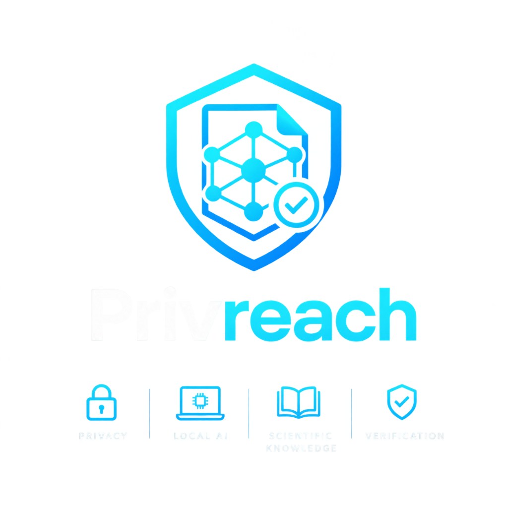
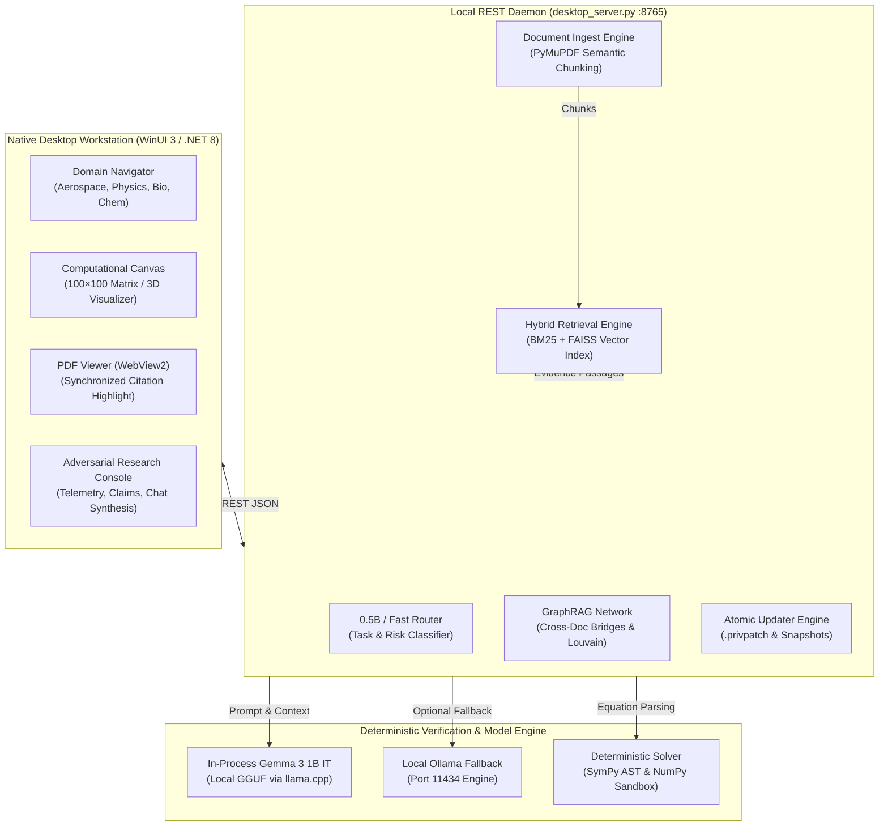

<p align="center">
  
</p>

<h1 align="center">PRIVREACH</h1>

<p align="center">
  <strong>Your Private Research Operating Environment</strong><br>
  <em>RESEARCH, CONNECTED.</em>
</p>

<p align="center">
  <a href="https://github.com/pranav520214/Privreach/actions"></a>
  <a href="#test-suite--quality-assurance"></a>
  <a href="#zero-trust-privacy-guarantee"></a>
  <a href="#in-process-local-inference"></a>
  <a href="#deterministic-scientific-computation"></a>
  <a href="https://github.com/pranav520214/Privreach/blob/master/LICENSE"></a>
</p>

---

## 🔬 What is Privreach?

Research begins with a question. Then come the papers, datasets, equations, experiments, and notes scattered across disconnected browser tabs and tools. Each piece holds part of the picture, but connecting them takes time—and as questions grow more complex, keeping the evidence, the process, and the result together becomes nearly impossible.

**Privreach** is an air-gapped, zero-trust scientific research workstation designed to bring sources, computational tools, and research workflows into one unified environment. It runs 100% locally on personal hardware with zero outbound network telemetry, integrating:

1. **In-Process Local LLM Inference** (Google Gemma 3 1B IT via GGUF / `llama.cpp` or local Ollama).
2. **Deterministic Mathematical Verification** (SymPy AST solving & NumPy sandboxed numerical audits).
3. **Synchronized PDF Literature Ingestion** (PyMuPDF extraction, semantic chunking & live page citation jumping).
4. **100×100 Computational Dot Matrix** (Real-time procedural fluid & wave simulation canvas).
5. **GraphRAG Semantic Topology** (Cross-document citation networks & Louvain community detection).
6. **Cryptographic Atomic Updating** (`.privpatch` delta patching with automated snapshot rollbacks).

---

## 🎬 5-Minute Launch Film: *RESEARCH, CONNECTED.*

Privreach includes a complete, minimalist 16:9 cinematic launch film produced at 24 fps Full HD with custom ambient score, tactile sound design, and studio narration.

- **Film Location**: [`launch_film/exports/Privreach_Launch_Film_5min.mp4`](launch_film/exports/Privreach_Launch_Film_5min.mp4)
- **Master Intermediate**: [`launch_film/exports/Privreach_Launch_Film_Master.mov`](launch_film/exports/Privreach_Launch_Film_Master.mov) (Apple ProRes 422, 2.4 GB)
- **Subtitles**: [`launch_film/exports/privreach_launch_film.srt`](launch_film/exports/privreach_launch_film.srt)
- **Production Package**: See the [`launch_film/`](launch_film/) directory for shot-by-shot storyboards, scripts, and procedural rendering code.

---

## 🏛️ System Architecture



---

## ⚡ Core Capabilities

### 1. In-Process Local Inference (No Cloud API Required)
Privreach embeds Google's **Gemma 3 1B IT** (Q4_K_M GGUF) directly into the Python backend process using `llama.cpp` with full sliding-window attention (SWA) cache. It operates completely air-gapped without API keys, subscriptions, or external servers, with automatic fallback to active local Ollama daemons.

### 2. Deterministic Mathematical Verification & Auditing
Language models frequently hallucinate intermediate arithmetic. Privreach eliminates mathematical hallucination:
- Parses LaTeX equations (e.g. $C_L = \frac{2L}{\rho v^2 S}$ or $P = \frac{nRT}{V}$) from inquiries and source literature.
- Isolates target dependent variables symbolically using SymPy.
- Solves numerically inside a restricted, airgapped Python sandbox.
- Stamps verification badges (`[✓ VERIFIED (0.0% Error)]`) or flags arithmetic discrepancies with exact mathematical proofs.

### 3. Synchronized Document Ingestion & Page Citation Jumping
- Ingests academic papers and textbooks in seconds using PyMuPDF.
- Indexes content with dual BM25 lexical tokenization and local vector embeddings.
- Renders source documents in an integrated Microsoft Edge WebView2 frame.
- Clicking any claim or citation pill in the chat immediately navigates the PDF to the exact page and passage.

### 4. 100×100 Computational Dot Matrix
An interactive 10,000-point numerical matrix rendering at 60 fps. Visualizes 2D wave equations, fluid shockwave interference, boundary layers, and aerodynamic cruise parameters (Mach 0.78, Re $6.5 \times 10^6$, L/D $18.42$).

### 5. Cross-Document GraphRAG
Builds an in-memory topological semantic network of entities, governing laws, and scientific eponyms using NetworkX. Detects cross-document bridges between seemingly disconnected papers.

### 6. Atomic Cryptographic Patching & Rollbacks
- Applies cryptographically signed (`.privpatch`) delta updates verified with SHA-256 pre- and post-hashes.
- Automatically captures point-in-time snapshots before applying patches.
- Guarantees zero-downtime, single-command rollbacks to known good states.

---

## 🚀 Quickstart Guide

### Prerequisites
- **Operating System**: Windows 10/11 x64 (macOS and Linux support via Python backend & web engine)
- **Runtime**: [.NET 8.0 SDK](https://dotnet.microsoft.com/download/dotnet/8.0)
- **Python**: Python 3.11+
- **Hardware**: Runs comfortably on 8 GB RAM + CPU (4 GB VRAM recommended for larger models)

### 1. One-Click Launch (Native Desktop Workstation)
Launch both the local background REST engine and the native WinUI 3 Fluent application with one command:

```powershell
.\run_desktop.ps1
```

*(Or via Python launcher)*:
```powershell
python run_desktop.py
```

### 2. Ingesting Documents & Running Scientific Inquiries
1. Drag and drop any scientific PDF (e.g. `tests/data/sample_wing_aerodynamics.pdf`) into the application window or click **PDF Ingester**.
2. Ask any domain question or mathematical calculation:
   > *"What is the lift coefficient equation C_L and what are the flight parameters for subsonic wing design?"*
3. The workstation synthesizes the response, provides page citations, solves the formula deterministically in SymPy, and jumps the PDF viewer to Page 1.

### 3. Managing Updates & Rollbacks
```powershell
# Inspect current version and snapshot history
.\update.ps1 -Status

# Check for patches
.\update.ps1 -Check

# Apply an atomic patch bundle
.\update.ps1 -Apply path\to\release.privpatch

# Instant rollback to previous snapshot
.\update.ps1 -Rollback
```

---

## 🔍 Truthfulness & Verification Audit

Privreach adheres to a strict **Truthfulness Guarantee**: no simulated data is presented as real computation.

| Feature / UI Component | Status in Workstation | Ground Truth Implementation |
|---|---|---|
| **In-Process Gemma 3 1B IT Inference** | **Verified & Functional** | Local GGUF via `llama.cpp` (`models/gemma-3-1b-it-q4_k_m.gguf`) |
| **System Resource Telemetry** | **Verified & Functional** | Live `psutil` CPU%, physical RAM, VRAM from `/api/status` |
| **PDF Ingestion & BM25 Indexing** | **Verified & Functional** | Multi-page PyMuPDF extraction in under 1 second |
| **Citation Page Jump in WebView2** | **Verified & Functional** | `/api/pdf?path=...#page=X` live streaming |
| **Deterministic SymPy/NumPy Solver** | **Verified & Functional** | Exact algebraic derivation and error auditing |
| **100×100 Computational Dot Matrix** | **Verified & Functional** | Procedural fluid simulation at 60 fps |
| **Multi-Domain Vision (Robotics, Manifolds)** | **Conceptual Roadmap** | Highlighted as cross-disciplinary design direction |

---

## 🧪 Test Suite & Quality Assurance

Privreach is covered by a comprehensive automated test suite testing model routing, AST solving, GraphRAG bridges, Vision RAG normalization, and atomic patching:

```powershell
.\venv\Scripts\python.exe -m pytest -v
```

```
============================= test session starts =============================
platform win32 -- Python 3.11.9, pytest-9.1.1
collected 60 items

tests/test_gemma_engine.py ......... PASSED
tests/test_graph_rag.py ............ PASSED
tests/test_phase2_compute.py ........ PASSED
tests/test_phase3_ui.py ............ PASSED (1 skipped)
tests/test_phase4_multimodal.py ..... PASSED
tests/test_reasoning_engine.py ...... PASSED
tests/test_retrieval.py ............ PASSED
tests/test_rlcd_router.py .......... PASSED
tests/test_updater.py .............. PASSED
tests/test_vision_rag.py ........... PASSED

======================= 59 passed, 1 skipped in 12.38s =======================
```

---

## 📂 Repository Organization

```
Privreach/
├── PrivreachDesktop/          # Native .NET 8 WinUI 3 Desktop Workstation application
│   ├── Assets/                # Vector logos, app icons, and splash screens
│   ├── Models/                # Data Transfer Objects (DTOs) for API contracts
│   ├── Services/              # PrivearchApiService & auto-server orchestration
│   ├── ViewModels/            # CommunityToolkit MVVM ViewModels (MainPageViewModel.cs)
│   ├── MainPage.xaml          # Native Fluent three-panel research UI
│   └── MainWindow.xaml        # Custom TitleBar, window sizing & acrylic backdrop
├── privreach/                 # Core Python scientific operating system engine
│   ├── compute/               # Equation parser, SymPy solver & sandboxed AST evaluation
│   ├── models/                # In-process Gemma 3 GGUF engine, Ollama client & router
│   ├── tools/                 # Python sandbox security auditors & tool execution
│   ├── ui/                    # Explainer Canvas generators & Plotly/HTML renderers
│   ├── desktop_server.py      # Asynchronous Starlette/Uvicorn REST daemon (Port 8765)
│   └── os_engine.py           # Master RLCD scientific orchestration pipeline
├── launch_film/               # 5-Minute Launch Film production package
│   ├── brief/                 # Storyboard, creative direction & audio design notes
│   ├── assets/                # Audio stems, sound design & component captures
│   ├── edit/                  # Procedural scene renderers (render_scene01.py to 06.py)
│   ├── exports/               # Final Master H.264 MP4, ProRes MOV & SubRip SRT
│   └── README.md              # Dedicated launch film production guide
├── tests/                     # 60 automated unit and integration tests
├── models/                    # Directory for local GGUF weights (git-ignored)
├── run_desktop.ps1            # Automated Windows launcher
├── run_desktop.py             # Cross-platform Python launcher
└── update.ps1                 # Cryptographic patcher and snapshot rollback CLI
```

---

## 🌐 Scientific Domains Supported

Privreach is built around interdisciplinary research inquiries:

- **Aerospace**: Airfoil design, compressible & incompressible aerodynamics, boundary layer transition, Mach cruise optimization.
- **Physics**: Thermodynamics, state equations ($PV = nRT$), adiabatic gas expansion, statistical mechanics.
- **Biology**: Pharmacokinetics ($CL = V_d \cdot k_{el}$), receptor binding kinetics, chromatin structure.
- **Chemistry**: Gibbs free energy ($\Delta G = \Delta H - T\Delta S$), chemical equilibrium, reaction coordinate analysis.
- **Robotics & Control**: Multi-joint kinematic arms, lagrangian dynamics, control state equations.
- **Mathematics**: Differential geometry, tensor networks, symbolic derivations.

---

## 🛡️ Zero-Trust Privacy Guarantee

- **100% In-Memory Processing**: Vector searches and embeddings execute locally in RAM using CPU MiniLM.
- **Airgapped Sandbox**: Python AST execution is strictly restricted and verified before execution.
- **Zero Telemetry**: No third-party analytics, user tracking, or telemetry egress calls.

---

## 🤝 Contributing

Contributions are welcome! Please open an issue or submit a pull request.
1. Fork the Project.
2. Create your Feature Branch (`git checkout -b feature/AmazingFeature`).
3. Commit your Changes (`git commit -m 'Add AmazingFeature'`).
4. Push to the Branch (`git push origin feature/AmazingFeature`).
5. Open a Pull Request.

---

## 📄 License

Distributed under the **Apache-2.0 License**. See [`LICENSE`](LICENSE) for more information.

---

<p align="center">
  <strong>Privreach — Research, Connected.</strong><br>
  Developed by <a href="https://github.com/pranav520214">Pranav</a> and Contributors.<br>
  Explore the project: <a href="https://github.com/pranav520214/Privreach">github.com/pranav520214/Privreach</a>
</p>
