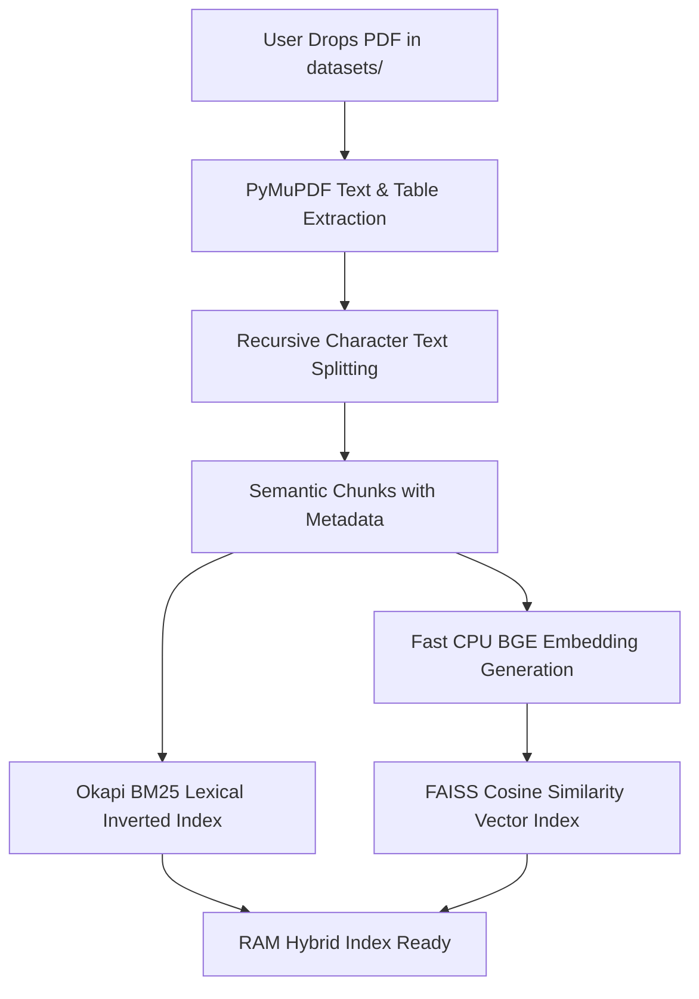
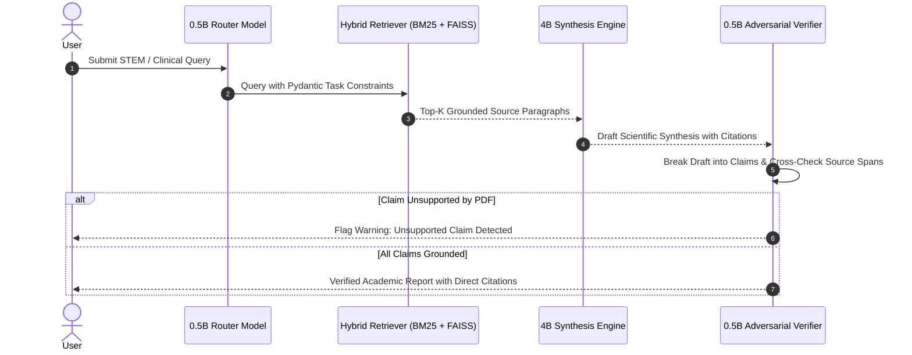

# Privearch Execution & Data Flows

## 1. Document Ingestion Flow

```mermaid
flowchart TD
    A[User Drops PDF in datasets/] --> B[PyMuPDF Text & Table Extraction]
    B --> C[Recursive Character Text Splitting]
    C --> D[Semantic Chunks with Metadata]
    D --> E[Okapi BM25 Lexical Inverted Index]
    D --> F[Fast CPU BGE Embedding Generation]
    F --> G[FAISS Cosine Similarity Vector Index]
    E --> H[RAM Hybrid Index Ready]
    G --> H
```

## 2. Query & Adversarial Verification Flow

```mermaid
sequenceDiagram
    autonumber
    actor User
    participant Router as 0.5B Router Model
    participant Retriever as Hybrid Retriever (BM25 + FAISS)
    participant Synthesizer as 4B Synthesis Engine
    participant Verifier as 0.5B Adversarial Verifier

    User->>Router: Submit STEM / Clinical Query
    Router->>Retriever: Query with Pydantic Task Constraints
    Retriever-->>Synthesizer: Top-K Grounded Source Paragraphs
    Synthesizer-->>Verifier: Draft Scientific Synthesis with Citations
    Verifier->>Verifier: Break Draft into Claims & Cross-Check Source Spans
    alt Claim Unsupported by PDF
        Verifier-->>User: Flag Warning: Unsupported Claim Detected
    else All Claims Grounded
        Verifier-->>User: Verified Academic Report with Direct Citations
    end
```
